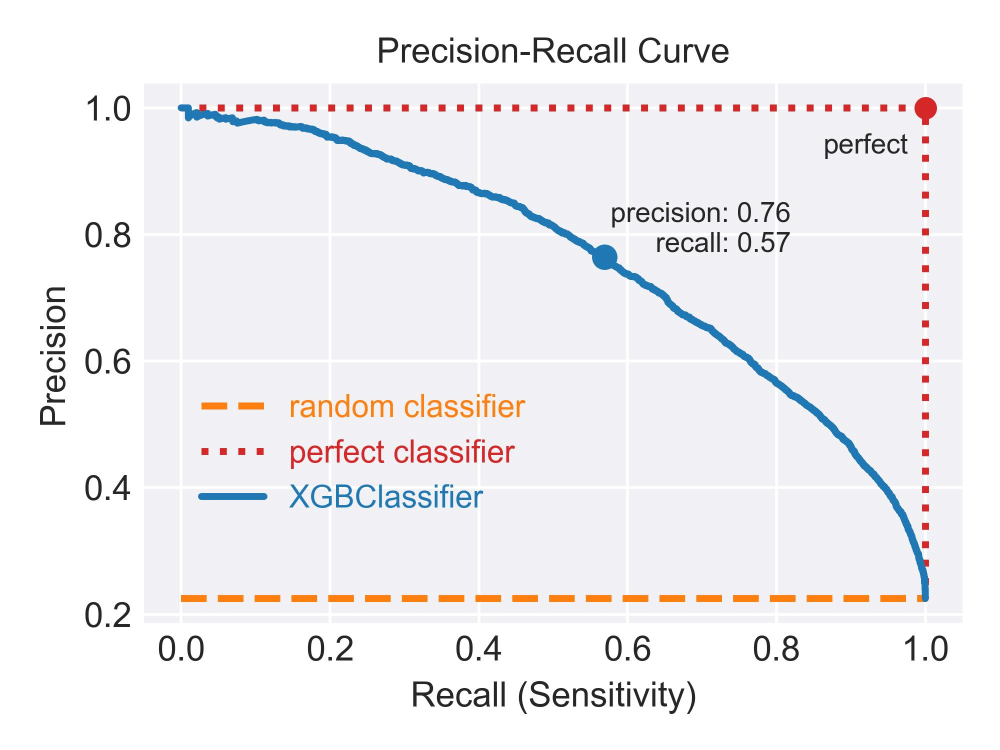

# PREDICT RAIN

Predict next-day rain in Australia by training on [Kaggle data](https://www.kaggle.com/datasets/jsphyg/weather-dataset-rattle-package) comprising 10 years of daily weather observations from many locations across Australia. 

The following models are used:
- **Logistic Regression**
- **XGBoost Classifier**
- **Random Forest Classifier**
- **Artificial Neural Network (ANN)**

Model performance is evaluated using various metrics: 
- Accuracy
- F1-score
- Confusion matrix
- ROC-AUC curve
- Precision-recall curve

For model interpretability, the following tools are utilized:
- Permutation feature importance
- SHAP values (SHapley Additive exPlanations)

\
**SELECT FIGURES**

